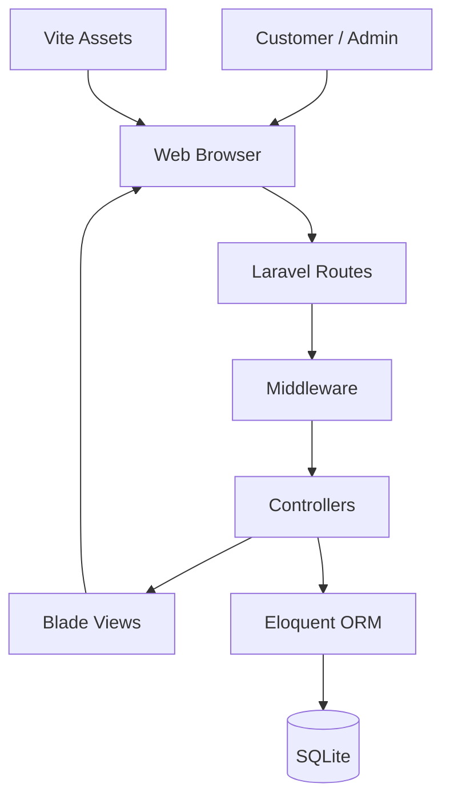
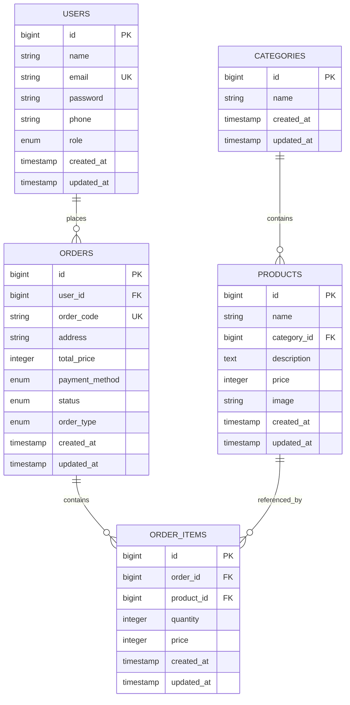
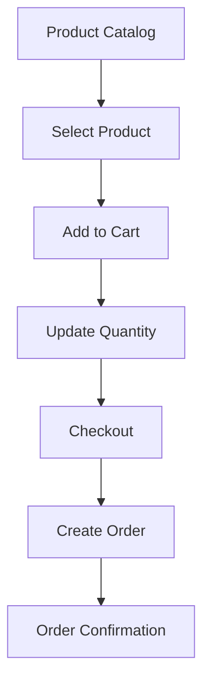

# E-Commerce Laravel

A web-based e-commerce application built with Laravel for managing products, customer orders, shopping carts, and basic sales reporting.

The application provides separate workflows for **customers** and **administrators**, with Laravel handling routing, authentication, business logic, database operations, and server-side rendering.

---

## Features

### Customer

* User registration and authentication
* Browse available products
* Product categorization
* Add products to cart
* Adjust product quantity
* Remove products from cart
* Checkout
* Select payment method
* Submit orders
* View orders and order history
* Manage profile

### Administrator

* Dashboard with store summary
* Product management
* Category management
* Order management
* Order detail view
* Update order status
* Mark orders as completed
* Generate invoice
* Sales report

---

## Application Architecture

The application follows Laravel's MVC architecture. Requests are handled through Laravel routes and middleware, processed by controllers, and persisted through Eloquent models.



### Request Flow

```text
Browser
   │
   ▼
Routes
   │
   ▼
Middleware
   │
   ▼
Controller
   │
   ├──────────────► Blade View
   │
   ▼
Eloquent Model
   │
   ▼
SQLite Database
```

---

## Database Design

The main transactional entities are users, products, categories, orders, and order items.



### Relationships

| Model      | Relationship         |
| ---------- | -------------------- |
| User       | Has many Orders      |
| Category   | Has many Products    |
| Product    | Belongs to Category  |
| Product    | Has many Order Items |
| Order      | Belongs to User      |
| Order      | Has many Order Items |
| Order Item | Belongs to Order     |
| Order Item | Belongs to Product   |

---

## Order Lifecycle

Orders move through a simple status workflow:


The order stores:

* Order code
* Customer
* Delivery address
* Total price
* Payment method
* Order status
* Order type
* Order items

Supported payment methods:

```text
COD
Transfer
QRIS
```

Supported order types:

```text
via_web
via_wa
```

---

## User Roles

### Customer

Customer-facing functionality is centered around browsing products and completing purchases.

```text
Login
  │
  ▼
Menu
  │
  ▼
Cart
  │
  ▼
Checkout
  │
  ▼
Order
  │
  ▼
Order History
```

### Administrator

The administrator workflow focuses on managing products and processing orders.

```text
Login
  │
  ▼
Admin Dashboard
  │
  ├── Products
  │
  ├── Orders
  │
  ├── Invoice
  │
  └── Reports
```

---

## Dashboard

The admin dashboard provides a quick overview of the store, including:

* Total products
* Incoming orders
* Total sales
* Recent activity

The product management interface also provides product statistics such as product count, average price, and active categories.

---

## Tech Stack

| Layer                 | Technology             |
| --------------------- | ---------------------- |
| Backend               | PHP                    |
| Framework             | Laravel                |
| ORM                   | Eloquent               |
| Frontend              | Blade                  |
| Asset Bundler         | Vite                   |
| Database              | SQLite                 |
| Authentication        | Laravel Authentication |
| Icons                 | Lucide Icons           |
| Dependency Management | Composer / NPM         |
| Version Control       | Git                    |

---

## Project Structure

```text
Ecommerce_Laravel/
│
├── app/
│   ├── Http/
│   │   └── Controllers/
│   │       ├── Admin/
│   │       └── Customer/
│   │
│   └── Models/
│
├── database/
│   ├── migrations/
│   ├── seeders/
│   └── database.sqlite
│
├── public/
│
├── resources/
│   ├── css/
│   ├── js/
│   └── views/
│
├── routes/
│   ├── web.php
│   └── auth.php
│
├── storage/
│
├── tests/
│
├── artisan
├── composer.json
├── package.json
├── vite.config.js
└── README.md
```

---

## Installation

### Requirements

Make sure the following are installed:

* PHP 8.3+
* Composer
* Node.js and NPM
* Git

### 1. Clone the repository

```bash
git clone https://github.com/ChenStormtout/Ecommerce_Laravel.git
cd Ecommerce_Laravel
```

### 2. Install PHP dependencies

```bash
composer install
```

### 3. Configure environment

Copy the example environment file:

**Windows**

```powershell
copy .env.example .env
```

Generate the application key:

```bash
php artisan key:generate
```

### 4. Configure SQLite

Create the SQLite database:

**PowerShell**

```powershell
New-Item database\database.sqlite -ItemType File
```

Make sure the database configuration in `.env` is configured for SQLite.

### 5. Run migrations

```bash
php artisan migrate
```

If you need to recreate the database during development:

```bash
php artisan migrate:fresh
```

> `migrate:fresh` removes the existing database tables and data.

### 6. Install frontend dependencies

```bash
npm install
```

### 7. Build frontend assets

```bash
npm run build
```

For development:

```bash
npm run dev
```

### 8. Start Laravel

```bash
php artisan serve
```

Open:

```text
http://127.0.0.1:8000
```

---

## Development

During development, Laravel and Vite can be run separately.

Terminal 1:

```bash
php artisan serve
```

Terminal 2:

```bash
npm run dev
```

Vite handles the frontend assets while Laravel serves the application.

---

## Database Migrations

The application uses Laravel migrations to define the database schema.

Main tables:

```text
users
categories
products
orders
order_items
```

Additional Laravel infrastructure tables include:

```text
sessions
cache
cache_locks
```

Foreign-key relationships are used between the main transactional tables to maintain referential integrity.

---

## Product Management

Administrators can manage the product catalog through the product management section.

Product data includes:

```text
Name
Category
Description
Price
Image
```

Products are associated with a category through `category_id`.

---

## Cart & Checkout

The shopping cart allows customers to select products and quantities before checkout.



Order items store the product, quantity, and price associated with each order.

---

## Screenshots

Screenshots can be added to the repository under:

```text
screenshots/
├── landing-page.png
├── login.png
├── customer-menu.png
├── cart.png
├── checkout.png
├── admin-dashboard.png
├── product-management.png
├── order-management.png
└── reports.png
```

Example:

```markdown

```

---

## Technical Notes

### ORM

Database access is handled through Laravel Eloquent models and model relationships instead of manually writing SQL for normal application operations.

For example:

```text
User
 └── Orders

Category
 └── Products

Order
 └── Order Items
      └── Product
```

### Database

SQLite is used as the development database, making the project straightforward to run locally without requiring a separate database server.

### Frontend Assets

Frontend assets are managed through Vite.

The application therefore requires the frontend dependency installation and asset build step before all pages can be rendered correctly.

---

## Possible Improvements

The current architecture can be extended with:

* Dedicated role-based middleware
* More granular authorization policies
* Payment gateway integration
* REST API
* Product stock management
* Order notifications
* Automated tests
* More detailed sales analytics
* Production deployment
* Dedicated image storage

---

## Purpose

This project was developed as a Laravel-based e-commerce application and serves as a practical implementation of:

* MVC architecture
* CRUD operations
* Authentication
* Middleware
* Eloquent ORM
* Relational database design
* Database migrations
* Shopping cart management
* Order processing
* Server-side rendering
* Frontend asset management

---

## License

This project is intended for learning and portfolio purposes.
